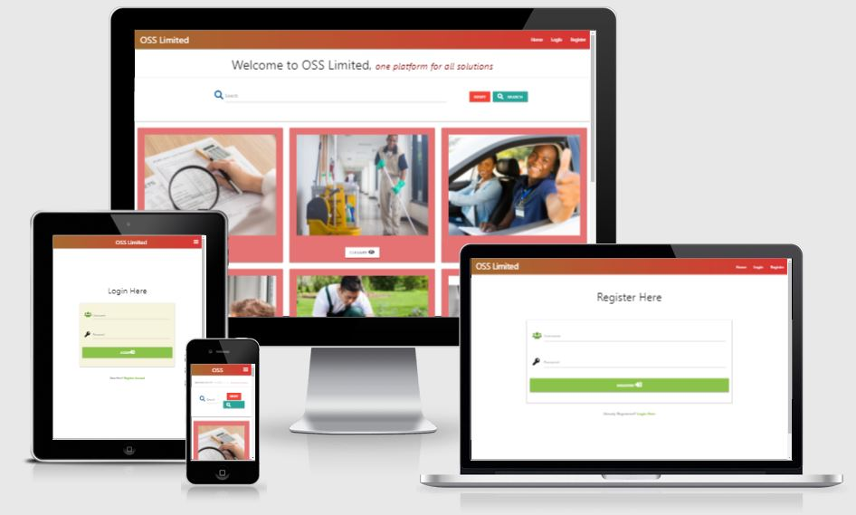

# ONE-STOP Solution



## Aim/ Purpose

The ONE-STOP Solution is a website dedicated as a platform for various self-employed people who want to sell their skills and provide services to the communities. The   website allows users to search and view various job type, register and add their own job to the page.This website is my Milestone Project 3 for the Full Stack Developer course at Code Institute. In addition, I am planning to use this website to start my own online business in the near future.

## Table of Contents

- [User Experiencess](#user-experiences)
  - [User Stories](#user-stories)
  - [UX Framework](#ux-framework)
  - [Wireframes](#wireframes)
- [Existing Features](#existing-features)
- [Features to be added in future](#features-to-be-added-in-future)
- [Issues and Resolutions](#issues-and-resolutions)
- [Technoligies Used](#technologies-used)
  - [Languages used](#languages-used)
  - [Frameworks, Libraries, Programme and Resources Used](#frameworks-libraries-programme-and-resources-used)
- [Code Validation](#code-validation)
- [Testing](#testing)
- [Deployment](#deployment)
- [Credit](#credit)
- [Media](#media)
- [Acknowledgements](#acknowledgements)

## User Experiences

The goal of this website is to provide a satisfactory user experience and an accessible platform for users to find various available services which can be useful to support the necessities and day-to-day activities. The website should allow users to easily register or login and search for the right services at the right time based on their requirements. The users are also able to easily add and edit their services as well as find the required services via this website.

### User Stories

#### First Time User Goals
- As a first time user, I would like to be able to search for any specific services on the website.
- As a first time user, I would like to be able to register and create my own account on the website.
- As a first time user, I would like to be able to add, edit and remove my own services.

#### Frequent User Goals
- As a frequent user, I would like to be able to search for any specific services on the website.
- As a frequent user, I want to login to my existing account to add, edit and remove my services.
- As a frequent user, I want to be able to save my services for other users to search and view them.
- As a frequent user, I would like to be able to logout from my own profile.

#### Return User Goals
- As a return user, I want to easily navigate the site across all pages.
- As a return user, I want to easily search for any specific services on the website.
- As a return user, I would like to be able to access my existing profile to add, edit and remove my services.
- As a return user, I want to be able to save my services for other users to search and view them.

## UX Framework

### Strategy

The ONE-STOP Solution is an online platform to access various services with front-end and back-end functionality, created using HTML, JavaScript, CSS, Python, Flask, and MongoDB. The goal is to create a website that is user-friendly and allows users to easily search and get various available services.

### Scope

The website is interactive and allows users to input or add their own services for other users to view or display, allowing them to edit and remove or delete their registered services and search for different services. The website has CRUD functionality.

#### Functional Requirements

Functional requirements include: a user-friendly navigation menu, a search bar, working templates for services to be added, database functionality that stores user login information and ability to create new accounts, with authentication. In addition, the website should be responsive for various screen sizes, whilst maintaining the same level of functionality. The main functionality of the website is to allow users to create, read, update, and delete data, known as CRUD. The data created is stored in a database, and can be read through various pages on the website. The users also have the option to update and edit the data they have submitted, as well as delete it altogether. A search field allows users to search for specific services they are interested in.

#### Content Requirements

The content of the site should include a header and image, as well as a navigation menu. A search bar should allow users to search for services types. For each service, an image should be included, as well as its type or category and a short description of the service. An input field for users will allow them to add different services.

### Structure

The website is structured to allow new visitors to view numerous services on the landing page once they open the website. From there, they are able to log in or register, which will allow them to create and view their profile page of existing services. Once logged in, users are able to click on the main header, which allows them to search for different services, as well as add and edit their own services. In addition, the users are able to save the registered services. Once the user wishes to end their session, they can click the 'Log Out' option in the menu to return to the home page.

### Skeleton

The skeleton of the website will utilise Materialize for the CSS layout of the pages. A navigation menu will allow users to go to their chosen pages. The main landing page will function to allow users to select numerous service types they are interested in, and provide links to add or edit their own services. This minimises the need for different pages for users to visit and provides a seamless experience. When adding or editing a service, additional options in the navigation menu allow the user to navigate back to their own profile, or to end the session and log out. This simplifies the number of options for the user and keeps the website easy to use.

### Surface

The surface design of the website will also utilise Materialize CSS to provide a theme and styling for the components of the website. Google Fonts is used to style the text using the Yusei Magic' and 'Ovo' fonts  and FontAwesome is used for various icons. The colour scheme is designed to be professionally appealing to the target audience of varied professionals, and provide clear readability as well as being responsive.

## Wireframes

- As an initial process of the project design, wireframes were created for desktop, iPad and mobile screen sizes using [Balsamiq](https://balsamiq.com/).

* Desktop Wireframe - [View](wireframes/ms3-wireframe-desktop.pdf)

* iPad Wireframe - [View](wireframes/ms3-wireframe-iPad.pdf)

* Mobile Wireframe - [View](wireframes/ms3-wireframe-mobile.pdf)

## Existing Features
- All the pages on this website are mainly didvided into 4 section which are:
  - Navbar
  - Flash Message
  - Main content
  - Footer

#### Navbar
- Navbar for this website is created by utilizing Materalize CSS framework, Navbar is on top of the page expanding full screen size with menu items on the right hand side and company name as Navbar brand on left hand side of the page. Navbar has three main links to welcome the users which are Home, Login and Register and user will be redirecting to the correct page once link is clicked. Additionally nav-links will be updated accordingly once user logged into the page and users will be able to see updated nav-links as below
  - My Account
    - user able to view their profile by selecting My account option on the Navbar
  - Add new job
    - user able to add new job to the page by selecting Add new job option on the Navbar
  - Logout
    - user able to logout from the page
  - View/Delete
    - This option is restricted to admin user only, option to gain access to this page is only visible once user logged in as an admin user

#### Flash message
- All the flash message will display just below the Navbar on every pages, python user flash library to generate the flash message and render to the page whenever required.

#### Main content
- This is the Main section of the page where informations and images are displayed to the user

#### Footer
- Small footer is created to hold the copyright information of the website which is final section of the page and sit at the bottom and each page of the website contain same footer with same copyright information

### Home Page
  - This website has very simple, easy to use and user friendly home page which is dividded into 4 sub sections which are Navbar, search field, images and footer.


#### Search field
- search field is situated just below Navbar on the page which allow user to search the job listed on the page just by typing the name of the job user wish to search and then hit search button on the right side of search bar, additionally reset button also added next to search field which allow user to cancel their search and simply display all the jobs available.

#### Job images
- This is the main section of the page where all the jobs available will be shown with images, Materalize card utilized on this section to render all the jobs to the page, each job will be shown with relevant image and below each image title of the Job is shown as a button, once button is clicked small modal will pop up to the screen and information retated to each job will display on the screen. All images and information related to this page stored in mongoDB collection and python language is used to render the images and information to the page from back-end.

### Register page
- This page allow user to register themself to the page which can be simply complete by filling the registration form provided, which has only 2 input fields, username and password. user must follow the certain format/pattern while registering and if user do not follow the required fromat while completing the registration form then flash message will display on top of the form to inform user about what need to be followed. Simple form with input element use to create the form and python functionality is use to check the user input and display flash message accordingly. Flash message will be diaply on the page once registration successful and user details will be stored in the mongoDB collections. Additionally this page utilize Werkzeuz security which is python library to hash the password and stored in database securley. Underneath the registration form small text with login option also provided which allow user to login directly if they are already registered however select register option by mistake. This allow user to peform registration and login task from the same page without having to navigate to the exact page.

### Login page
- This page looks very identical to register page and contains similar options however only accessible to those user who is already registered to the page, user simply need to input their username and password to login to the page, once login successful flash message will display on screen to welcome the user and user will be redirected to their own profile. This page utilize some python functionality to check and verify the users input and only allow user to login if their details matched with what they have provided while registration. Additionally python will display the flash message to inform user if username or password they supplied is not found and redirect the user back to login page again. Underneath the login form small text with registration option also provided which allow user to register directly if they are not registered however select login option by mistake. This allow user to peform registration and login task from the same page without having to navigate to the exact page.

### Add new Job page
- This option is visible to the user only once they are logged into the page, this page allow user to add their own job by completing the form provided and then hit submit button. input elements in the forms need to fullfll certain criteria and if supplied input do not match certain criteria or left empty then warning message will appear below input field and colour of the bottom border will change to red, also required attribute is utilize on this form to ensure user are not able to submit the form without completing, if any of the field left empty and hit submit button then required attribute trigger and let user knows that they must complete the field. Python funtionality also added to this page to conduct some check to ensure that only user are able to add the job. once user select the option to add new job then python function will excute and do some checks and only let user to add the job if user in the session and user who logged in are the same person, otherwise python will immediatley redirect user to login page and display flash message accordingly. Javascript in the form of jQuery is utilized to validate the form and display and hide error message accordingly while user completing the form. Once user added the information, python will then send the information to mongoDB using insertOne method and also render the information in the home page

### My Account page
- This option also only visible to the user once they are logged in. Python function will execute once user select this option and check to verify the user first and if person selecting the option is really a user then python will allow user to access the page and display welcome message to the user, if user is not verified then python will redirect user to the login page and display flash message accordingly. Once user verified and inside the page user able to see all the job added to the page by themself and also able to edit and delete if they wish to do by just clicking the buttons brovided below job images.
  #### Edit/delete job
  - user can edit or delete their own job once they are inside their own account, every job added by user will be shown in My account page with job images and job title, each job has two options for user which are edit and delete. Once user select edit job option then python function will trigger to check wether person trying to edit the job is really a user or not, if not then user will be redirected to login page aagin with correct flash messaeg and if the person is really the user then python will populate the form with pre-field data in the input field and allow user to update their job information. Similar to add new job form, edit job form also need to pass the input validation check which is done by utilizing Javascript in the form of jQuery. once inpt field validate and user select the update button then all the updated information will be store in the database which is done by using updateOne method.
  Additionally user can also delete their own job, once user select delete button python will trigger the delete function and run if/else statement to check user's details and let user to act accordingly. First python will check if user is in the session or not then second step python will check if user logged in is the similar user who add this job. if both condition is satisfied they only user will be able to delete the job otherwise python will redirect the user to login page and display flash message accordingly
  python use mongoDB remove() method to perform delete job once condition satisfied. Once user select the delete button, modal will trigger and display warning message on screen to allow user to confirm their delete request or cancel, purpose of this modal is to prevent deleting the job straightway if user select the delete button by mistake or in case user wants to change their mind once after delete button clicked. 

### View/Delete page
- This page is only for admin user, and option to access this page will only be visible once user logged in as an admin, python functionality does the initial check to ensure user logged in to the page is admin and display view/delete option if login user is really an admin user else redirect user to the login page and display flash message accordingly if user login is not an admin user. once if condition satisfied user will then have access to the page where all the jobs will be shown with image, job title and view/delete buttons. admin user can view all the jobs and also able to delete any job from this page using the buttons provided.

### Logout
- This option only visible to the user once they are logged into the page, user can simply select the logout option and they will be loggout from the page, python function will execute once user select logout option and redirect them to login page immediately and display flash message accordingly.

## Features to be added in future
- Option for user to send email enquiry/text message directly from the job information page without having to fill the form
- option to book for the job with the company directly from the website 
- option to allow user to make an online payment once job booked abd confirmed and send email conformation of booked job and payment to the user email.

## Issues and Resolutions
- Live browser did not worked and upon checking on Gitpod terminal , Error 98 was shown
  - I did my research on google/slack and stack overflow and found the solution of it by closing all the open ports by using kill command as below :
    1. _First I viewed all the open ports by clicking on Ports which is displayed on bottom right of my workspace_
    1. _Then I typed lsof -i:<'port number'> command in my terminal, this displyed PID associated with port number_
    1. _Finally I have used kill -9 <'PID'> command which then kill the port that I wanted._

- I was not able to see the live preview on browser while using python3 app.py command on my terminal, upond checking on the terminal I noticed that ValueError was shown
  - I then checked all of my codes and logic and noticed [typo](static/images/valueerror1.jpg) on env.py file where I typed MONGO.URI instead of MONGO_URI, problem solved after i fixed this typo.

- Browser threw werkzeug.routing.BuildError while I was initially testing my registration page, this took me a while to figure out as I couldn't spot any issue in my codes and neither any speeling error, however I have somehow spoted that there was [typo](static/images/typo1.jpg) on app.py file as I as missing @ symbol on my routing and this was causing an error which solved after I corrected this.

- There was [TypeError](static/images/typeError1.jpg) shown on live browser and also on my terminal while I was testing my account.html page after writing python logic to app.py file. upon checking the error message I knew that this was related to app.py file and I started to run through logic on app.py file and found that I was missing to pass an argument inside the function while creating function for account.html page, issue ressolved once I passed an argument to the function.

- [405 error](static/images/405error.jpg) noticed While I was testing my add_job.html page on live browser, I was mainly checking the functionality to add new job however it didnt worked and threw an error
  - I did some depth research on 405 error and then start checking my logic on app.py then I spotted that no methods were given while creating @app.route for add_job template, I then added methods=["GET", "POST"] to @app.route which then fixed an issue

- Issue with POST method on the form that I created to add new job for users, I filled the form and submit however after checking on MongoDB databse, I have noticed that some of the input value were not shown on collection , instead [null](static/images/null1.jpg) was shown, upon cross checking all the name and speelings on my HTML and flask I have found that there was mismatch on the name that I used, I was using job_description on HTML and description on app.py file while building POST method and this was causing problem which then fixed once I updated this

- I stored some images on my databse using their URL which I wanted to render on my home page directly, however upon testing on browser images did not displayed, instead only URL was shown as a string. I had to then do some depth research on how to store images on mongoDB however I couldnt find any easy process, after few hours of struggle I decided to re-check my codes and noticed that I have [not supplied img tag inside jinja for loop](static/images/image_url1.jpg) in home.html which was causing an issue in this case. This one sorted after I updated my jinja for loop with img tag inside the loop.

- Modal that I used on the home page did not worked as expected, I was testing page on live browser after adding six jobs and I was expecting modal to trigger and disply information upon clicking on each button however all the button displayed same information instead of each button showing different information
 - I did depth online research on how to use modal while inside the loop and cross check on my code then I realised that issue was due to my modal-id the as modal was in a loop - and each time I run that loop if the modal id was the same so it was keep just retruning the same detail - so I needed to use unique id when modal call. I have set modal id as below which then resolve my issue
```
id="job_modal{{ job._id }}
```

- Registration functionality did not work while I was testing by as a user. After completing registration form, flash message display which confirm registration successful however it did not logged me into the page when supplying same login credentials to login page, instead keep displaying flash message which inform that incorrect username/password.
  - I quickly went through if statement inside the register function on my app.py and all of the logic was ok to me, also couldnt find any error on my html template then I decided to quickly check on my mongoDB and noticed that user login detais were not passed to my database which then gave me some sort of idea on where the issue was so I decided to re-check my python logic on app.py file and finally discover an issue. I created dictionary to store username and password which was within my else statement which means if else condition excute then username and password supposed to stored in register dictionary then passed to database using mongo command which was not happening due to I created [dictionary outside of else statement](static/images/login-error.jpg) and only after returning the register template this means else statement never reached to the dictionary that I build to store user credentials. I then moved register dictionary inside else statement which then solved this issue

- Images related to each job type on the home page and my account page were not responsive instead image were stretcing on larger screens and shrinking on small devices.
  - I have used object-fit property on my style.css targeting the image to fix this issue
    ```
    object-fit: cover;

    ```
  
- I encountered further issue with responsiveness on the card and images on all of my pages as they were not responsive and also whitespace were not utilized properly when viewing on different screensizes
  - I decided to restructure my HTML codes for card and images and checking step by step during build process which gave proved to be an easier way to find the problem and additionally I did depth research to understand offset class on grid layout which I finally understood clearly and at the end restructring HTML codes and utilizing materalize offset class solved my problem.

- There was an issue with form validation on my page, each input field was expected to validate using javascript/jQuery validation however textarea input did not validate.
  - When I move my cursor to input field, it was already in the middle of the textarea and not in the beginning however couldnt figured out why there was space, I checked all the codes and possible whitespace but nothing was there then finally I have found the solution of this on StackOverflow. Indeed there was a space before closing textarea tag on my HTML however this was not easily noticable due to indentation issue, I then had to remove the whitespace before closing textarea tag and move this one line up to resolve this issue.
    - BEFORE 
      ```
      <textarea id="desc" name="desc" class="materialize-textarea validate"
            required>
      </textarea>

      ```
    - AFTER
      ```
        <textarea id="desc" name="desc" class="materialize-textarea validate" required></textarea>
        
      ```

- I was keep getting an Squiggly line in one of the if statement which I created to protect password, I knew that line means something wrong with my code however I was not able to find exact issue, additionally upon testing my if statement, it was excuted as expected and not affecting any of my work therefore I couldnt think much about this as an issue. Finally when I was checking my codes using PEP8 online checker this was showing as an [E711 error](static/images/pep8-error.jpg) and at this point I understood that this code is not PEP8 compliant, after doing some research I have found that comparisons to the singleton objects, like True, False, and None, should be done with identity, not equality. I then slightly change my code and re-check on PEP8 and then all passed.
  - Before 
     ```
      if (char.search(password_supplied) == None):
     ```
  - After
     ```
      if (char.search(password_supplied) is None):
     ```

## Technologies Used

### Languages Used
- [Python](https://www.python.org/)
    - I have used  **Python** as the back-end programming language for my project.
- [HTML](en.wikipedia.org/wiki/HTML)
    - I have used **HTML** as the main structural element of my project.
- [CSS](https://en.wikipedia.org/wiki/Cascading_Style_Sheets)
    - The project uses **CSS** to style and theme pages..
 - [Javascript](https://en.wikipedia.org/wiki/JavaScript)
    - The project uses **Javascript** to allow for DOM manipulation.

### Frameworks, Libraries, Programme and Resources Used  
- [JQuery](https://jquery.com)
  - The project uses **jQuery** as the primary JavaScript functionality. This is both the standard jQuery that is built with Materialize components, and my custom jQuery used in my script.js file.        
- [Flask](http://flask.palletsprojects.com/en/1.1.x/)
  - The project uses **Flask**, which is a Python microframework. **Flask** help to dynamically generate pages, generate dynamic links, and content within the application.
- [PyMongo](https://api.mongodb.com/python/current/)
    - The project uses **PyMongo** as the Python API for MongoDB. This API enables linking the data from the back-end database to the front-end app.
- [Materialize](https://materializecss.com/)
    - The project uses the **Materialize** framework to simplify the structure of the website and make the website responsive easily.
- [MongoDB](https://www.mongodb.com/)
    - The project uses *** MongoDB *** to store the database in the cloud. The information displayed in the front-end is pulled from the database store.
- [Jinja](https://jinja.palletsprojects.com/en/2.10.x/)
  - Jinja templating language was used with flask in the HTML code. Jinja was used simplify my HTML code, avoid repetition, and allow simpler linking of the back-end to the front-end.
- [Google Fonts:](https://fonts.google.com/)
    - Google font was used to embed the YuseiMagic and Ovo types font which are used on all pages throughout the website.
- [Font Awesome:](https://fontawesome.com/)
    - Font Awesome was used to add icons for aesthetic and UX purposes.
- [Balsamiq:](https://balsamiq.com/)
    - Balsamiq was used to create the wireframes during the design process.
- [Gitpod](https://www.gitpod.io/)
    - Gitpod was used as IDE for local development.
- [GitHub](https://github.com/)
    - GitHub was used to store the projects code after being pushed from Gitpod.
- [Git](https://git-scm.com/)
  - Git was used as aversion control system to regularly and add commit changes made to project and pushing them to GitHub
- [Heroku](https://id.heroku.com/login)
  - Heroku was used as the hosting platform to deploy my project.
- [HTML Formatter](https://htmlformatter.com/) 
    - HTML formatter was used to format HTML code
- [Unicorn Revealer](https://chrome.google.com/webstore/detail/unicorn-revealer/lmlkphhdlngaicolpmaakfmhplagoaln/related) 
    - Unicorn Revealer tool was used to identify any overflow issues
- [Lighthouse](https://developers.google.com/web/tools/lighthouse)
    - Lighthouse was used to test the performance and loading speed of the website
- [W3.CSS](https://www.w3schools.com/w3css/defaulT.asp) 
    - General resources.
- [Stack Overflow](https://pt.stackoverflow.com/)
    - General resources.
- [Youtube](https://www.youtube.com/) 
   - General resources.
- Code Institute SLACK Community
   -General resources

## Code Validation

- [W3C Markup Validation](https://validator.w3.org/#validate_by_input) 
  - W3C Markup Validation was used throughout the process to validate HTML codes
- [W3C CSS Validation](https://jigsaw.w3.org/css-validator/) 
  - W3C CSS Validation was used to vaildate CSS codes
- [JSHINT](https://jshint.com/) 
  - JSHINT was used for JavaScript code warning & error check.
- [PEP8 online](http://pep8online.com/)
  - PEP8 online tool was used to ensure all python codes on projects are PEP8 compliant.
- [Python Tutor](https://pythontutor.com/visualize.html#mode=edit)
  - Python tutor was used to visualize the python code and identify any error.


## Testing 
Website was tested through the build process using live browser and dev tool , additionally each pages were tested using Google Chrome, Microsoft edge and Safari. Also live pages were tested using Desktop, Laptop, iPhone, iPad and Android phone. Test document can be found here - [CLICK HERE TO VIEW](TEST.md)


## Deployment

I used GitHub for my version control and Heroku to host the live version of my project. To deploy my website to Heroku, use following steps:

1. Create the app in Heroku.
2. Run the `npm install -g heroku` command in the terminal window to install heroku in the workspace.
3. Run the `heroku login -i` command in the terminal window and enter credentials to login to Heroku.
4. Add and committ the files to Git using the `git add .` and `git commit -m ""` commands in the terminal window.
5. Create a requirements.txt file using the following command in the terminal window:

    ```pip3 freeze --local > requirements.txt```

7. Created a Procfile using the following command in the terminal window:

  ```echo web: python <fileName.py> > Procfile```

8. Run the `git push -u heroku main` command in the terminal window to push the app to Heroku.
9. Login to the Heroku page and Entered the following Config Var in Heroku:
   - IP : `0.0.0.0`
   - PORT : `5000`
   - MONGO_URI :`mongodb+srv://<username>:<password></password>@<cluster_name>.9kpcw.mongodb.net/<database></database>?retryWrites=true&w=majority` 
   - SECRET_KEY : `<your_secret_key>`
10. Select Deploy option on Heroku and choose Github as Deployment method then connect to Github and search for repositery to connect by providing the repo name on search box.
11. Heroku will then detect the repo on Github then, click connect
12. Choose main branch as branch to deploy and click Enable automatic Deploys
13. your project has now deployed to Heroku
14. In the top right of the heroku dashboard press the "Open App" button to view your deployed Heroku app.


## Credit

- Thanks to SDTE- Automatopn Techie for [youtube video](https://www.youtube.com/watch?v=mG3aGgFYJSE) on special character vaerification, this video help me to understand the concept of password validation with special character.
- Thanks to The IT Guy for [youtube video](https://www.youtube.com/watch?v=W4-5WM60gWg&t=121s), this video helped me to understand the input field validation with error message on form. I have also taken some of the code from this video and modified as per my requirement.

## Media
- All the images used in this project are taken from [Google](https://www.google.com/)

## Acknowledgements
- I would like to thank my mentor Chris Quinn for his guidance and advice on this project before submission.
- Thanks to everyone on Slack Community for always being on-hand with requests and support.
- Thanks to everyone on CI tutor support team for always providing with the support and guidance.
- Thanks to everyone from Student Care team (CI) for keeping me update with all changes such as tutor support availibility holiday period and most importantly checking regularly on my progress and always ready to support on my study.

## Disclaimer
- This website was build for educational purpose only